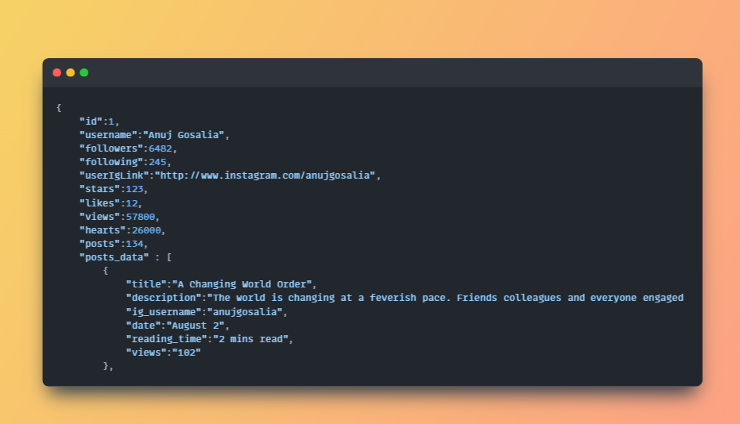

# TerriblyTinyTales ([https://6556970f0140ac13f6502b43--cerulean-griffin-dc095a.netlify.app/](https://6558ffe8040c86176e340b0b--dainty-scone-cc90ae.netlify.app/))

- This repository contains an assignment from TerriblyTinyTales. The assignment focuses on building a mobile-friendly "profile screen" with the following features:
- # Features
  1).Renders a clean and elegant profile screen suitable for mobile devices, as follows: [Profile](https://www.terriblytinytales.com/profile.jpeg) (this is a sample screenshot taken from mobile view)

  2).The profile data is hardcoded into this  file and then fetched into Stories component.

  3).The screen when opened on different mobile types, is rendered consistently. This can be checked by changing device types in chrome's developer tools.

# Getting Started:

- I have made three components Stories, Navbar and Card in the same order.  
-  I have hosted this site on [Netlify]([https://6556970f0140ac13f6502b43--cerulean-griffin-dc095a.netlify.app/](https://6558ffe8040c86176e340b0b--dainty-scone-cc90ae.netlify.app/)) and All details is here on the github readme.

- **Libraries used** : 'Tailwind CSS' , 'React-Icons'

- To run this code on your system , Clone this repository and cd into the project directory and run the command **npm install** and then **npm run dev** and you're good to go.

- Thankyou , looking forward to your reply.
  
